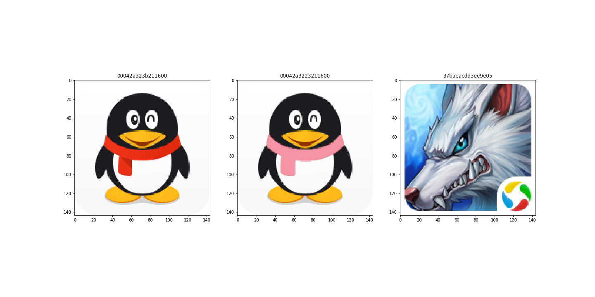
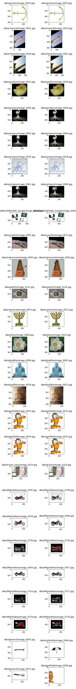

# 感知哈希算法 dhash

## 数据集下载
http://www.vision.caltech.edu/Image_Datasets/Caltech101/

## 算法流程
1. 缩放 -> 灰度
2. 对比差异 -> 转换哈希
3. 计算汉明距离: 两个字符串对应位置的不同字符的个数。(将一个字符串变换成另外一个字符串所需要替换的字符个数。)

> 参考 https://github.com/hjaurum/DHash

## 优化查询
假设当 hamming 距离小于3时,说明两张图像相似.

在10亿(2^34条数据)海量数据场景下,如何提高检索效率?

1. 一种方案是: 遍历待查询图片的 dhash code 所有3位以内变化的组合.大约需要四万多次的查询。
2. 另一种方案是: 预生成数据库中所有图片的 dhash code 所有3位以内变化的组合.大约需要四万多倍的空间。
3. 抽屉原理: 将 64 位平均分成 (3+1) 个块,即每个块含有 16 位.如果两张图片的 hamming 距离在 3 以内,它们必有一个块完全相同.

> 参考 https://www.kancloud.cn/kancloud/the-art-of-programming/41614

## 演示

